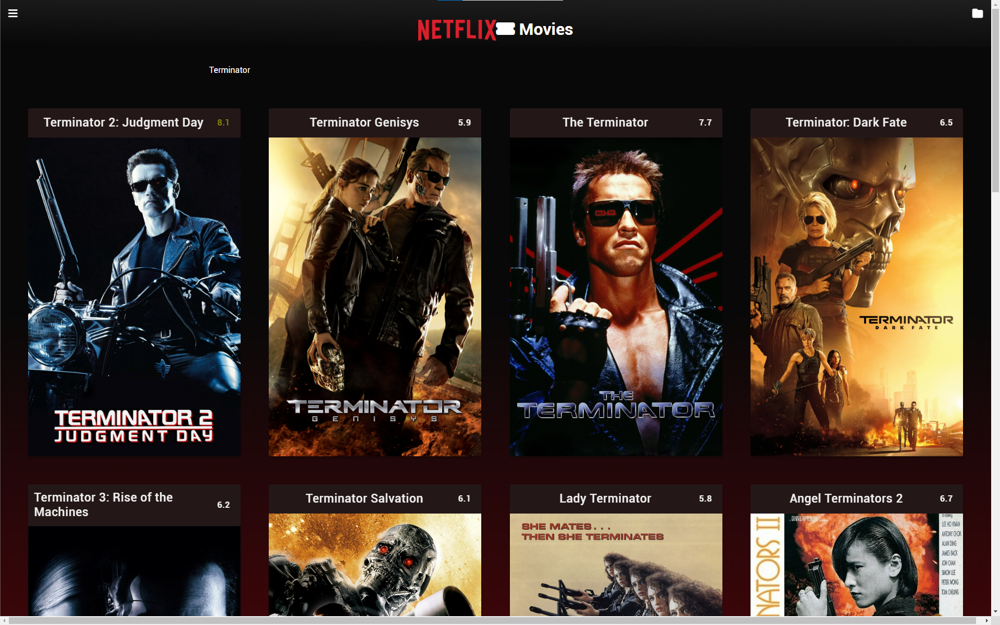
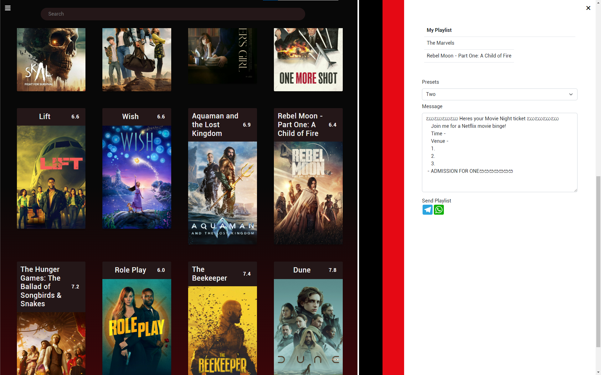

# WAD2_Movies
Sometimes, we just want to have an easy and quick fix to our movie itch. And when it comes to watching a movie with a group of friends, there can be a real hassle when deciding on one final outcome.  This project was meant to be let users search through a consolidated list across various streaming services and create shareable movie listings with custom template messages to various chats for family/friends.

# Run
Clone this repository and run `index.html`

# Features
[]
- Use the search bar to search for your favourite movies
- Hover cursor over movies to view their synopsis
- Double click movie titles in the homepage to add them to your playlist
[]
- Click and drag movie titles in your playlist to reorder them. Double click to remove them from playlist.
- Customise your message and send them on Whatsapp or Telegram

# Demostration Link
Click here for our project demonstration: https://www.youtube.com/watch?v=IRq5LDx6sxc

For full project commit history, refer to my teammate's Github: https://github.com/ebenezerphua/WAD2-PROJECT
